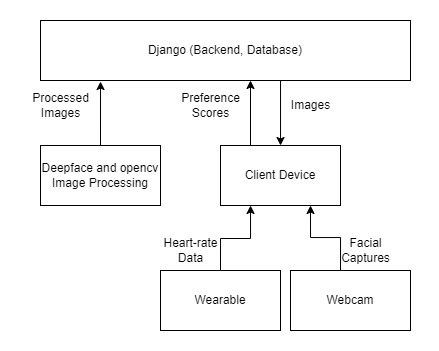

# eMUC - Advanced dating software that matches you based on your true preferences
### A truly personal dating and match maker, based on what you truly prefer

**This app is designed to help you find your EEE/EIE soulmate. We decided to create a database consisting of every single Imperial electrical engineering student and professor, because frankly no other department would be eligible for this project. After doing this quick 4-minute process, you will find out who your soulmate is from EEE.**

**Inspired by novel uses of health data available through the terra API, we thought about what way we could use the data to generate great experiences that were truly personal. Using the terra technology, we realised the best way to use the data was to allow people to explore their personal preferences in their significant others.**

**eMUC’s revolutionary approach to a dating app explores your preferences in people by exploring how you react when presented with different images of people. We use terra API to fetch heart rate data as our system cycles through pictures, looking for the one to truly get your blood pumping. Our system also measures people's emotional response to the image shown to further influence our matching algorithms**

## How Does the System Work?

- First, we supply a dataset of potential suitors from the eee intrenet. Each picture is then analysed using computing vision to detect ethnicity, gender and age.
    - Deepface is used to detect the face in the picture and find the coordinates using mtcnn model.
    - Open cv then manipulates the image so it is just the face that is submitted.
    - Deepface is then used to anaylse the face to categorize the person.
    - This runs once on a set of images to present it ready for the main code and the results are stored in the main database in Django.
- On the website homepage you enter your age and gender preference which then selects the top 10 suited bachelors for you.
    - You are taken to a loading page where the API reads your heartrate for 30 seconds to learn your resting heart rate. This is to create a baseline measurement to compare readings taken during image presentation with. This method was chosen to provide to allow measurments to be accurate for all who may use the system.
    - You are then taken to your first picture for 15 seconds. The Terra API measures your heart rate over a ten second period. It then looks at facial emotion of the user and detects the emotion of the user. 
    - Using both results you are scored a category which provides you a score for each picture. If your score is higher for a certain race, age, gender then the program refines your pictures to better suit your preferences. Eventually the picture with the highest score is your soulmate!

Above is a flow diagram showing how data moves in the system. Deepface and openCV image processing run once to setup the system, passing the images with their interpreted (???) attributes to the mongo database. This provides a foundational dataset for the rest of the system to operate on.

The client device serves as a data middle mane, directing and reqesting data as directed by the users responses. This will typically be a phone or laptop that the user is using to access the system. Using the Terra API, heart rate data is retrieved from the wearable device. Similar methods of facial image processing using Deepface and openCV are used to extract the emotion from images taken by the webcam. These along with the heart-rate data are passed to the client device.

The client device will then analyse the responses, updating the scores for the categories of main indicators - age, ethnicity, and gender. There are scores for subcategories in these main indicators (e.g. different age ranges for age, and the different ethnicities for ethnicity). These scores are returned to the django database where it decides which image to provide to the client next. This cycle repeats for the 10 images the system is set to present before making its final conclusions.

## Requirements
The python scripts require the following modules to be installed:
- Deepface
- opencv
- django DB

